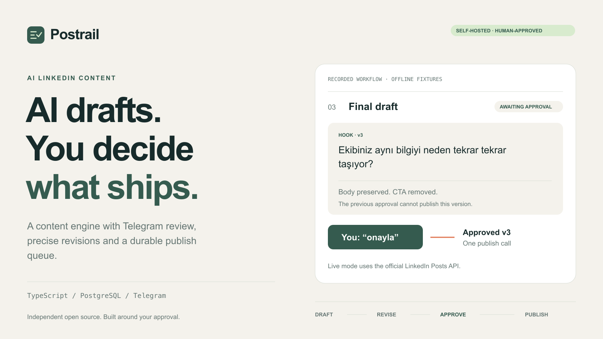
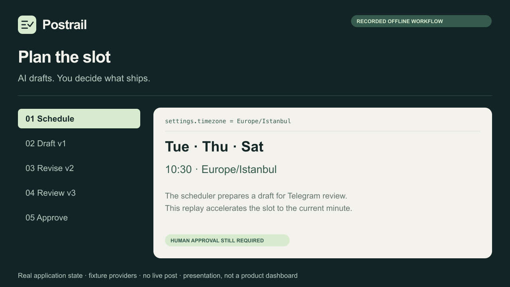
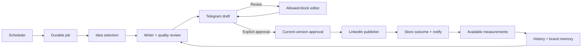

<p align="center">
  
</p>

<h1 align="center">Postrail</h1>
<p align="center"><strong>AI drafts. You decide what ships.</strong></p>
<p align="center">Self-hosted AI LinkedIn content, natural-language revisions, and Telegram approval — with a durable workflow behind every post.</p>

<p align="center">
  <a href="https://github.com/atasardacagan/postrail/actions/workflows/ci.yml"></a>
  <a href="https://nodejs.org/"></a>
  <a href="https://www.typescriptlang.org/"></a>
  <a href="https://www.postgresql.org/"></a>
  <a href="LICENSE"></a>
</p>

<p align="center">
  <a href="#try-it-without-accounts">Quick start</a> ·
  <a href="#watch-the-workflow">Workflow demo</a> ·
  <a href="docs/SETUP.md">Deployment guide</a> ·
  <a href="docs/ARCHITECTURE.md">Architecture</a> ·
  <a href="docs/SETUP.tr.md">Türkçe kurulum</a>
</p>



**Spend your attention on the final judgment.** Postrail maintains an idea backlog, drafts and reviews content, delivers it to Telegram, applies focused edits, and publishes the version you explicitly approve through the official LinkedIn API.

The current product is a **Turkish-first backend service with Telegram as its review interface**. English documentation explains how to run and extend it. Each deployment serves one configured operator. The covers and demo are presentations of recorded offline data, not screenshots of a shipped web dashboard or a connected LinkedIn account.

## Try it without accounts

Requirements: **Node.js 24+** and npm. Clone the source, then run the complete local acceptance flow:

```sh
git clone https://github.com/atasardacagan/postrail.git
cd postrail
npm ci
npm run check
npm run demo
```

No `.env`, Docker, API keys, Telegram account, or LinkedIn account is needed for this path. It runs the real scheduler, migrations, revision logic, approval gate and persistence using PGlite, with explicit fixture adapters for the writer and external services. The result prints `PASS`, three versions and one publication-adapter call. It sends nothing to a real account.

For a persistent local API:

```sh
npm run dev:offline
```

Open `http://127.0.0.1:3000/health/ready`. This is an API, not a dashboard. Data lives in `.data/postgres`. See the [offline API examples](docs/API.md#offline-geliştirme-yardımcıları) to inspect drafts or simulate Telegram updates. The offline content pool is finite and exists to exercise behavior, not evaluate live AI quality.

## Watch the workflow



A **16-second presentation of an actual offline run**: the application generated the draft, performed both edits, checked approval and stored the publication. Only the playback timing and visual layout are composed. The scheduler slot is accelerated for recording. No live AI, Telegram or LinkedIn request is made. [Recorded data and visual provenance](assets/README.md).

| You send in Telegram | What happens |
| --- | --- |
| `girişi daha kısa ve vurucu yap` | A new version changes the opening; other blocks remain intact. |
| `CTA’yı çıkar` | The CTA is removed, while the remaining blocks stay unchanged. |
| `onayla` | The current, explicitly approved version can enter the publication queue. |
| `2 saat ertele` | The schedule moves forward; a fresh approval is required. |
| `iptal` | The draft becomes cancelled and cannot publish. |

Replies and inline buttons target a particular draft version. An old button cannot approve new text. Free-text approval is bound to the draft visible when the message is received, before queued commands run.

## What is included

| Capability | Implementation |
| --- | --- |
| **Editorial backlog** | A configurable pool of 30–50 ideas, content pillars, topic/format cooldowns and recurring series. |
| **Draft + independent review** | Separate structured writer and critic calls, deterministic quality rules and bounded retries. |
| **Focused revisions** | Server-selected block IDs constrain changes. Ambiguous edit targets ask for clarification. |
| **Version-bound approval** | Immutable versions and approval records; publication checks the current and approved versions together. |
| **Durable execution** | PostgreSQL jobs, inbox/outbox, leases, deduplication and transactional publication records. |
| **Official integrations** | Telegram Bot API; LinkedIn OAuth and versioned Posts API; OpenAI Responses. |
| **Measurable learning** | Manual metrics or permission-gated LinkedIn analytics. Observed patterns guide suggestions while retaining exploration. |
| **Operator control** | Protected API for ideas, calendar, drafts, source notes, memory, settings, recovery and reporting. |

The default calendar prepares three drafts per week: **Tuesday, Thursday and Saturday at 10:30, Europe/Istanbul**. Sunday reports default to 18:00. Days, times and content preferences are stored in the database. A schedule creates a review opportunity; it never grants permission to publish.

## How it works



A Fastify API and worker share PostgreSQL. PostgreSQL also holds the queue, so Redis is not required. n8n is optional: the included workflow calls a protected scheduler endpoint, while all approval and publication rules remain in the backend.

Explore the [architecture and failure boundaries](docs/ARCHITECTURE.md), [content engine](docs/CONTENT_ENGINE.md) and [repository transaction contract](docs/REPOSITORY_API.md).

### The difficult part: failures after a publish request

A successful HTTP request and a successful database commit are separate events. Postrail does not claim an external exactly-once guarantee. If a LinkedIn POST times out or returns an ambiguous server result, it enters `publish_uncertain` and **stops automatic republication**. The operator checks the actual profile and reconciles an existing post. Telegram notification retries never re-run LinkedIn publication.

## Connect your own accounts

```sh
npm run env:init
# Edit .env with your own provider credentials and callback URL.
npm run doctor
# On a machine with Docker Engine and Compose:
docker compose up --build -d
```

`env:init` creates independent local secrets and refuses to overwrite an existing `.env`. `doctor` reports missing or invalid fields without printing their values; it checks local configuration, not provider permissions.

You need a Telegram bot and private user ID, an OpenAI API key, and LinkedIn Developer App access with OAuth. Complete the **[English setup guide](docs/SETUP.md)** before enabling live use. It covers Telegram bootstrap, LinkedIn products/scopes, OAuth, database migration, deployment, configuration, the first draft and recovery. [Turkish operator guide](docs/SETUP.tr.md).

| Setting | Purpose |
| --- | --- |
| `TELEGRAM_BOT_TOKEN`, `TELEGRAM_ALLOWED_USER_ID` | Only your private Telegram identity can act on drafts. |
| `LLM_API_KEY`, `LLM_MODEL` | Configure the live structured writer and critic. |
| `LINKEDIN_CLIENT_ID`, `LINKEDIN_CLIENT_SECRET`, `LINKEDIN_REDIRECT_URI` | Configure the OAuth connection. |
| `DATABASE_URL`, `POSTGRES_PASSWORD` | PostgreSQL connection; Compose configures its internal host. |
| `ADMIN_API_TOKEN`, `TELEGRAM_WEBHOOK_SECRET`, `TOKEN_ENCRYPTION_KEY` | Independent administration, webhook and encryption secrets. |

See [`.env.example`](.env.example) for all fields. Keep the encryption key stable: replacing it makes stored OAuth tokens unreadable.

## Security and privacy

- Publication requires explicit approval from the allowed private Telegram user. There is no administrative HTTP approval endpoint.
- Webhooks require a secret header. Administrative routes require a bearer token.
- OAuth state expires and is single-use; stored provider tokens use AES-256-GCM encryption.
- Source notes, drafts, revisions, interactions and metrics live in your database. In live mode, content context is sent to the configured AI provider and review messages are sent to Telegram.
- No LinkedIn password, browser automation, scraping, connection-request automation or automatic DM campaign is used.
- User-scoped queries are an application boundary; PostgreSQL RLS and multi-tenant user authentication are not implemented. Run one operator per deployment.

Read [SECURITY.md](SECURITY.md) for the threat model, deployment responsibilities, private reporting and known limits. This project is not independently security-audited.

## Verification and scope

The recorded local validation includes **182 passing tests with zero skipped**, including nine tests against native PostgreSQL 17.10. Tests cover unauthorized users, stale and delayed approvals, scoped revisions, concurrent publication claims, cancellation/postponement, ambiguous external outcomes, OAuth and missing metrics. The [validation record](docs/VALIDATION.md) gives the environment and exact limits; this number is a recorded result, not a live CI badge.

```sh
npm run check           # Typecheck, lint, unit/integration tests, build
npm run demo            # Complete account-free acceptance scenario
npm run test:postgres   # Requires an explicit disposable TEST_DATABASE_URL
```

GitHub CI also passes on Node.js 24 with PostgreSQL 17 and builds the production Docker image. Live account calls, provider permissions, real model output quality and deployment startup still need their own verification. LinkedIn analytics may require additional product approval; unsupported metrics remain absent. Quality checks do not perform autonomous web fact-checking. The default similarity detector is lexical; embedding support is an extension point. Performance learning is a heuristic over observed data, not model training or a growth guarantee.

## Roadmap

The text-post workflow is implemented. Next areas are deployment evidence, English/multilingual content support, a dashboard, richer media formats and broader data-source adapters. Multi-tenant onboarding, billing and self-service OAuth require additional work. [Current scope and roadmap](docs/ROADMAP.md).

## Contributing

Start with [CONTRIBUTING.md](CONTRIBUTING.md). Small reproducible bugs, clearer documentation and tests around real failure conditions are useful contributions. Changes must preserve version-specific human approval. If you find Postrail useful, a star helps other developers discover it.

## License and author

[MIT](LICENSE). Created and maintained by [@atasardacagan](https://github.com/atasardacagan); contributions are welcome. Postrail is an independent project and is not affiliated with or endorsed by LinkedIn, Telegram or OpenAI.

[Changelog](CHANGELOG.md) · [Release notes](docs/releases/v1.0.0.md) · [Portfolio kit](portfolio/PROJECT.md) · [Brand assets](assets/README.md)
