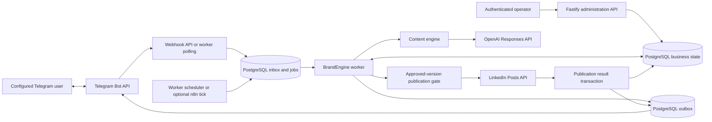
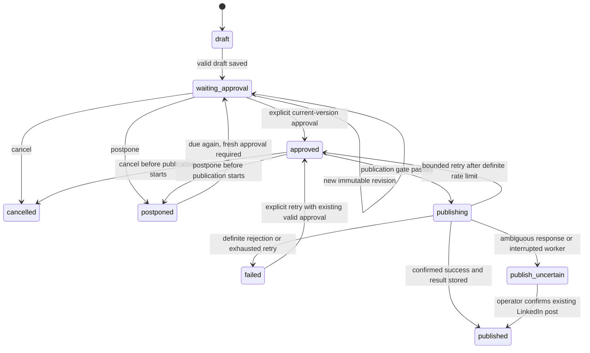

# Architecture

This project is a self-hosted content workflow for one LinkedIn account, with Telegram as the human approval interface. It generates and revises Turkish text posts, preserves their history, publishes the explicitly approved version, and uses available performance data to inform later content choices.

The central boundary is explicit: **the content model can propose text; it cannot authorize publication.** Publication requires a current, version-specific approval from the configured Telegram user. This is enforced in application code, database transactions, and the publication state machine—not only in a model prompt.

The implementation uses Node.js 24, strict TypeScript, Fastify, PostgreSQL, Zod, Luxon, and provider adapters. PostgreSQL holds both business state and durable queues. Redis, a separate message broker, and n8n are not required to run the core workflow.

## Runtime and module boundaries



| Module | Responsibility |
| --- | --- |
| [`src/core`](../src/core) | Domain types, validated configuration, timezone-aware schedules, environment diagnostics, and state transitions. |
| [`src/content`](../src/content) | Idea strategy, writer/editor requests, structured revisions, quality checks, repetition detection, and optional research/embedding extension points. |
| [`src/db`](../src/db) | PostgreSQL and PGlite adapters, migrations, immutable versions, approval transactions, queues, leases, and tenant-scoped repository operations. |
| [`src/services/engine.ts`](../src/services/engine.ts) | Coordinates jobs, Telegram commands, draft generation, publication, notifications, and periodic analytics collection. |
| [`src/services/analytics.ts`](../src/services/analytics.ts) | Records measured snapshots, calculates descriptive scores, groups patterns, and creates weekly reports. |
| [`src/services/oauth.ts`](../src/services/oauth.ts) | Persists single-use OAuth state, encrypted credentials, expiration, and conditional refresh. |
| [`src/integrations`](../src/integrations) | HTTP adapters for Telegram, LinkedIn publishing/analytics, OAuth, plus explicit offline test adapters. |
| [`src/api.ts`](../src/api.ts) | Authenticated administration routes, Telegram webhook, health endpoints, and OAuth callback. |
| [`src/runtime.ts`](../src/runtime.ts) | Dependency composition, live/offline adapter selection, worker loop, and polling coordination. |

`src/main.ts` runs the API process. `src/worker.ts` runs background work. Both use the same repository and database. The native offline launcher combines API and worker for local development and stores state in an embedded PGlite database. Production configuration rejects offline mode.

n8n can call the authenticated `/v1/tick` endpoint. It does not own approval, versioning, publication, or retry decisions. The same deduplication keys are used whether a tick originates from n8n or the built-in worker.

## Persistence model

All operational dates are stored as PostgreSQL `timestamptz`; scheduling interprets local times through the configured IANA timezone. The default schedule is Tuesday, Thursday, and Saturday at 10:30 in `Europe/Istanbul`. The report default is Sunday at 18:00.

| Data group | Tables and purpose |
| --- | --- |
| Account and settings | `users`, `system_settings`: one configured operator per deployed runtime; validated content and schedule settings are persisted as JSON. |
| Strategy and calendar | `content_topics`, `content_ideas`, `content_calendar`: category metadata, idea backlog, and unique user/slot assignments. |
| Draft lifecycle | `post_drafts`, `post_versions`, `approvals`: current state, immutable text/content versions, and immutable approval records. |
| Publication audit | `publish_attempts`, `published_posts`: attempted provider operations, known outcomes, remote URN, approved version, and final URL. |
| Telegram workflow | `telegram_inbox`, `telegram_interactions`, `telegram_messages`, `telegram_sessions`: deduplicated input, revision context, message/version mappings, and the active draft. |
| Durable work | `jobs`, `outbox`, `runtime_state`: scheduled jobs, retryable notifications, and polling ownership/offset state. |
| Brand and evidence | `brand_memory`, `source_facts`: controllable style preferences and operator-supplied source claims. |
| Learning | `linkedin_metrics`, `content_performance`: measured snapshots and derived descriptive performance dimensions. |
| Provider authorization | `oauth_states`, `oauth_connections`: expiring OAuth state and encrypted token payloads. |

Composite foreign keys bind child records to the owning `user_id`, post, and version. Unique constraints prevent duplicate calendar slots, Telegram updates, job keys, and publication records. Database triggers reject changes to version/approval audit records and invalid post lifecycle transitions.

Migrations are ordered by full filename, run transactionally under a PostgreSQL advisory lock, and recorded with SHA-256 checksums. A modified applied migration is rejected; subsequent changes should be introduced in a new migration. Separate files may share a numeric prefix because the full filename is the migration identity.

## Draft generation and revision

A scheduler tick materializes jobs from the beginning of the current local day through the next fourteen days. Existing durable jobs remain subject to normal queue processing. Slot keys make repeated ticks idempotent; the generator also checks whether a queued slot still matches current schedule settings.

The idea backlog target defaults to forty and is configurable between thirty and fifty. Selection balances the education/opinion/building/commercial mix, penalizes recently repeated categories, formats, and series, and incorporates sufficiently supported performance patterns while retaining an exploration share.

Live generation uses separate writer and critic requests with schema-validated responses. The critic scores hook, value, originality, readability, brand fit, lead potential, and authenticity. Deterministic checks additionally validate content shape, length, paragraph size, hashtag/emoji limits, banned phrases, source references, and textual repetition. The engine makes a bounded number of generation attempts before returning a recoverable quality failure.

Content is stored as ordered blocks with stable IDs and a `hook`, `body`, or `cta` kind. The revision interpreter resolves an allowed set of block IDs before asking the model for edits. The editor returns block-level replacements or permitted deletions. Applying those edits preserves all other blocks exactly and rejects unauthorized deletion, reordering, or insertion. Ambiguous requests ask the user to clarify rather than silently widening the edit scope. Explicit full rewrites can choose a different format.

Each accepted change inserts a new immutable version and returns the post to `waiting_approval`. No earlier approval is inherited by the new version. Initial quality failures retain their calendar slot and idea with a failed job that an operator can retry; failed revisions preserve the existing draft.

### Evidence and repetition limits

The default similarity implementation is a lexical approximation using normalization, token frequencies, a small synonym map, and separate comparisons for text, hooks, recent topics, and CTAs. It is not an embedding model. An `EmbeddingPort` can be injected into the live content engine, but the default runtime does not configure an embedding provider.

Facts are supplied through the protected API and must be marked verified before they are eligible as evidence. Numerical and personal claims receive deterministic checks and a separate model review. These checks reduce unsupported claims; they are not independent internet verification or a guarantee that every factual error will be detected.

A Hacker News adapter and `TrendSource` interface exist as extension points. They are not automatically scheduled by the default runtime. Collected headlines remain unverified research leads. The application stores manually supplied article URLs as references and does not fetch arbitrary article URLs from the administration API.

## Approval is bound to the version the user saw

The ingress path validates the Telegram payload, the sender ID, the private-chat type, and the chat ID before accepting a command. Webhook delivery additionally requires the configured Telegram secret header. The configured user ID is checked server-side and cannot be changed through ordinary content settings.

Within one inbox transaction, the repository:

1. Inserts the Telegram update using a unique user/update key.
2. Resolves the replied-to message or active session to a specific post and version.
3. Stores that target—or an explicit missing target—in the durable Telegram job.

This binding happens when the update is received. A plain “onayla” command delayed in the queue cannot attach itself to a newer version produced afterward. A command received before any draft exists cannot acquire a future draft when execution begins. Inline callback payloads must match the stored message/version context.

On approval, the repository locks the post, checks that the requested version is current and waiting for approval, inserts the approval record, moves the post to `approved`, and enqueues publication in the same transaction. There is no administration endpoint that creates a publishing approval.

The publication gate then locks and checks the post again. It requires all of the following:

- `status = approved`;
- requested version = current version = approved version;
- a persisted approval record for that version;
- the scheduled time has arrived.

Only then does it create a `started` publish attempt and change the state to `publishing`. The LinkedIn request runs after this transaction commits.

## Publication state and failure semantics



The code also defines `idea` and `revision_requested` states for lifecycle completeness. The current text workflow normally inserts a `draft` and saves successful revisions directly as a new `waiting_approval` version.

Successful publication stores the remote result, marks the attempt successful, moves the post to `published`, and inserts the Telegram success notification in one transaction. Failed Telegram delivery cannot cause another LinkedIn publish.

| Outcome | Persisted behavior |
| --- | --- |
| Valid LinkedIn creation response and URN | Commit publication and notification together. |
| Explicit rate-limit rejection | Preserve the approved version and schedule bounded backoff; automatic provider retries are capped by persisted attempt count. |
| Definite authentication, permission, or request rejection | Keep the draft and approval; expose a version-bound manual retry action. |
| Timeout, server error, unexpected success shape, or other ambiguous publish result | Move to `publish_uncertain`; no automatic or manual re-publish through normal retry routes. |
| Worker interruption while a post remains `publishing` | Recovery marks the stale attempt uncertain instead of retrying the external POST. |
| Confirmed existing remote post after uncertainty | An authenticated operator records its URN through the explicit reconciliation endpoint; this makes no LinkedIn publish request and is idempotent for the same URN. |

**There is no claim of exactly-once delivery across the LinkedIn network boundary.** The provider adapter does not rely on an undocumented remote idempotency mechanism. Database locks, approval checks, unique records, and job deduplication prevent repeated application publication in known states; ambiguous external outcomes deliberately stop automation. This trades automatic recovery for avoiding accidental duplicate posts.

## Durable queues and worker coordination

The repository uses PostgreSQL `FOR UPDATE SKIP LOCKED` for claiming work. A user-row lock plus a fresh active-job check permits one active business job per tenant. Telegram jobs additionally preserve their receipt order, including while an earlier command is waiting for retry. Unrelated jobs can proceed when they do not violate that ordering rule.

Claims include a random lease token and expiry. Completion and failure updates require the same token and an unexpired lease, so a reclaimed job cannot be acknowledged by its old worker. The runtime claims one business job at a time with a fifteen-minute lease and uses explicit provider timeouts. Expired work can be reclaimed; state/version checks remain necessary because a job is not an exactly-once execution primitive.

Notifications have a separate outbox and a shorter lease. Confirmed Telegram message IDs are stored with their post/version mapping. Send failures use bounded backoff and eventually remain visible as failed outbox records with an administration retry route. Telegram `sendMessage` does not provide a transaction with the local database: a crash after delivery and before acknowledgement may produce a duplicate notification on retry. It cannot grant approval or trigger a second confirmed LinkedIn publication by itself.

Polling replicas coordinate through a short database lease and durable update deduplication. Webhook and polling ingress both use the same authorization and inbox logic. Polling advances its offset after receipt processing; restarting may redeliver an update, which the inbox rejects as a duplicate.

## Analytics and brand memory

LinkedIn analytics is optional and separately permissioned. The collector requests impressions, reactions, comments, and reposts for the specified post; it validates the returned metric and entity before storing data. Missing values remain `null`, while a real provider-reported zero remains zero. Follower change, profile views, and inbound leads can be entered manually; they are not invented when unavailable.

The descriptive performance score requires impressions and all three engagement counts:

```text
min(100, (reactions + 3 × comments + 4 × reposts) / impressions × 100)
```

The stored score is rounded to two decimal places. Incomplete or zero-impression snapshots do not receive a score. Older snapshots cannot replace a later performance result. Patterns group category, format, hook shape, length band, CTA presence, local publication day, and hour, with shrinkage toward the observed overall mean. The strategy requires at least three examples before using a pattern for selection or writing guidance. Time-related patterns are reported for inspection; posting times remain operator-controlled.

This is a heuristic feedback loop, not model training, a causal experiment, or a growth guarantee. Brand memory likewise records selected repeated editorial preferences; it can be disabled, inspected, toggled, or deleted through the protected API. Stored memory only affects content context and never authorizes publication.

## Security and deployment boundary

The deployed runtime is configured for one allowed Telegram user and one LinkedIn connection. Repository scoping and composite foreign keys prepare the data model for account separation, but this release is not a complete multi-tenant SaaS: tenant onboarding, delegated authorization, billing, and database row-level security are not implemented.

The operational trust boundary includes the server administrator, database credentials, Telegram bot/webhook secrets, the administration bearer token, and LinkedIn credentials. An operator with direct database or server access is outside the untrusted-model boundary. Approval safeguards should not be represented as protection against a compromised administrator or database.

OAuth state is random, hashed at rest, expiring, and atomically single-use. Token payloads are encrypted using AES-256-GCM with account-specific authenticated context. Refresh is attempted only when a provider-supplied refresh token is still valid; otherwise the user must authorize again. Concurrent refreshes serialize on the stored connection row. This bounded provider refresh call intentionally occurs while that row is locked, unlike the external publication request, which runs outside a database transaction.

Logs record structured operational events and omit raw provider payloads, headers, OAuth query strings, and credentials. `.env`, `.data`, build output, dependency directories, and logs are excluded from Git; the Docker build context also excludes local environment and data files. These exclusions do not replace reviewing files and any existing history before publication.

The Docker layout consists of PostgreSQL 17, a migration job, an API service, and a worker service. Application containers run as an unprivileged user with a read-only filesystem, a temporary `/tmp`, dropped Linux capabilities, and no-new-privileges. The API binds to host loopback by default; a production HTTPS ingress is an operator responsibility. PostgreSQL storage is durable and needs an operator-managed backup/restore plan. The health endpoint verifies database reachability, not provider permissions or complete worker liveness.

## Verification evidence and limits

On **2026-09-08**, an isolated native **PostgreSQL 17.10** instance ran the complete suite successfully: **182 tests across 10 files, zero skipped**. The temporary server bound only to localhost, used generated test credentials, and stopped after validation. Typecheck, lint, and build also passed on the reviewed implementation.

The real-PostgreSQL subset includes eight concurrency tests with separate connection pools and one complete scheduler → hook revision → CTA removal → explicit approval → publication-record/notification test. It covers concurrent startup migrations, duplicate updates and approvals, one publication starter, version compare-and-set behavior, per-user job serialization, lock skipping, and database constraints. The remaining suite exercises PGlite-backed state/workflow tests, provider HTTP contracts with controlled responses, OAuth, content, schedules, and environment diagnostics.

Use [`POSTGRES_TESTING.md`](POSTGRES_TESTING.md) to reproduce the PostgreSQL checks with a disposable database. `npm run test:postgres` fails when `TEST_DATABASE_URL` is missing; ordinary `npm test` explicitly skips that subset without the variable.

External providers use controlled test adapters or HTTP fixtures during automated validation. This evidence does not validate a real LinkedIn app's entitlements, live OAuth consent, a live Telegram conversation, production LLM output quality, or publication to an actual account. Docker build and deployment validation are separate from the native PostgreSQL result. See the maintained [validation record](VALIDATION.md) for the current release status.
