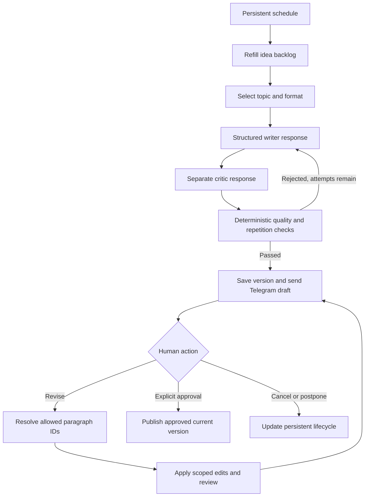

# Content engine

The content engine turns a maintained idea backlog into reviewable LinkedIn text posts. It drafts, checks, and revises content; the application separately handles scheduling, Telegram approval, version storage, and publishing.

The central boundary is architectural: the `ContentEngine` interface exposes `ideas`, `generate`, `revise`, and `rewrite`. It has no approval method, LinkedIn credentials, or publishing tool. A favorable model review cannot authorize a post.

## How a draft moves through the system



The configured posting time starts the approval workflow. A draft does not become eligible for publication merely because its scheduled time has arrived. Every successful revision creates another version requiring explicit approval.

## Turkish content with a business focus

The current implementation is Turkish-first: the settings schema accepts `contentLanguage: "tr"`, and the writer instructions, revision parser, fixtures, and Telegram interaction examples are Turkish. Changing one locale string does not provide tested multilingual support.

The default positioning is a practitioner who connects web development, AI, and automation to practical business outcomes. Categories cover web design, landing pages, CRO, CRM, n8n, AI agents, SaaS, operations, and related founder topics. Audience metadata helps the writer address business owners and operational teams as well as developers.

The writing instructions ask for short paragraphs, a clear opening, natural technical terminology, and useful advice without constant selling. They discourage stock AI phrases, inflated promises, invented customer results, and fabricated personal experiences. Hypothetical examples must be identified as hypothetical. These are editorial instructions backed by checks; they do not establish that model output will always sound human or perform well.

## A backlog and a balanced selection policy

Ideas store a title, category, audience, angle, hook suggestion, content pillar, format, optional series, priority, freshness, and usage state. The default backlog target is 40 unused ideas; the configurable range is 30–50.

Live generation requests at most ten ideas per model call. Accepted ideas are included in the next batch's exclusion context, and server-side filtering rejects disallowed categories and close repetitions. A request for 40 ideas makes at most four calls; a request for 50 makes at most five. The loop does not continue indefinitely to replace rejected results. It can return a smaller valid batch for a later backlog pass to replenish; no valid results produces a controlled quality error.

The selector targets this mix over recent content:

| Pillar | Default share | Typical purpose |
| --- | ---: | --- |
| Education | 60% | Explain a problem, method, or practical check. |
| Opinion | 20% | Present a reasoned view or tradeoff. |
| Building in public | 10% | Share supplied project material or a clearly framed design approach. |
| Soft commercial | 10% | Connect a relevant business problem to an optional conversation. |

`selectIdea()` calculates the largest allocation deficit over the latest 20 distinct posts in the supplied history. In the current application, that history includes current versions of non-cancelled drafts as well as published posts. It does not count revisions as additional posts. The percentages are long-term targets, rather than exact quotas for each three-post week.

Within the selected pillar, priority and freshness contribute to ranking. Recent category reuse reduces an idea's score; recent format and series reuse receive additional penalties. These are ranking penalties, so a small or heavily filtered backlog can still produce adjacent related topics. Used ideas and disabled categories are excluded.

## Bounded writing and quality review

`LiveContentEngine` uses a structured writer response followed by a separate critic response. Both use the configured model through `JsonModel`; separate roles do not imply separate model providers or independent human verification. The provider adapter requests strict JSON-schema output, disables response storage in the request with `store: false`, and validates the parsed result with Zod. A missing live key, refusal, incomplete response, invalid structure, or failed provider request produces an error rather than silently returning an offline sample.

The critic scores hook, value, originality, readability, brand fit, lead potential, and authenticity. The application recomputes the overall score from those seven values. An explicit rejection, reported issue, unsupported claim, or score below the configured threshold prevents that candidate from becoming the reviewable draft.

The deterministic gate also checks:

- Exactly one opening hook, at least one body block, at most one final CTA, and unique block IDs.
- Configured length limits, a 3,000-character ceiling, and paragraphs no longer than 650 characters. The usual 600–1,600-character target is writing guidance; configured limits are enforced.
- A small set of disallowed stock phrases, excessive emoji, and the configured hashtag policy.
- Unknown or unverified source IDs and selected classes of unsupported claims.
- Whole-text, opening, topic, and CTA repetition against the available history.

New generation allows three writer/critic attempts by default, with an implementation cap of four. Each provider request has a default 60-second timeout. Rejected drafts can be regenerated within that bound; external failures are handled by the persistent job layer. Revision checks can reject an edit, but never silently improve unrelated paragraphs.

## Editing only the requested paragraphs

Each paragraph is a block with a stable ID and a kind: `hook`, `body`, or `cta`. The server resolves an allowed set of block IDs before asking the model for edits. It then rejects unknown IDs, edits outside that set, unauthorized deletions, and responses that smuggle multiple paragraphs into a single edit.

Blocks outside the allowed set are copied from the current version, preserving their exact text and order. For example:

| Telegram request | Resulting scope |
| --- | --- |
| `girişi daha kısa ve vurucu yap` — make the opening shorter and stronger | Hook only. |
| `CTA’yı çıkar` — remove the CTA | Deterministic CTA deletion, followed by quality review. |
| `Bu kısmı bırak, sadece CTA’yı değiştir` — leave that part, only change the CTA | CTA only. |
| `ikinci paragraf iyi ama başlangıcı değiştir` — the second paragraph is good, change the beginning | Preserve the second paragraph and edit the hook. |
| `girişi kısalt ve CTA’yı çıkar` — shorten the opening and remove the CTA | A scoped hook edit plus deterministic CTA deletion. |
| `çok kurumsal olmuş, daha doğal yaz` — make the language more natural | Existing paragraphs may be edited to satisfy the global style request. |
| `yeniden yaz` — rewrite | A fresh draft on the same topic using another configured format. |

The parser handles common Turkish instructions, paragraph numbers, some explicit preservation phrases, and quoted text that resolves to one block. It is deliberately bounded. An ambiguous reference such as “remove this example” without an identifiable paragraph requests clarification; it does not authorize a full rewrite by inference. Adding a CTA when no CTA block exists currently requires the rewrite path.

Conversation context is supplied to the editing model, but cannot expand the server's edit permissions. After editing, the content is checked again and saved as a new version only if those checks pass. A failed edit retains the previous version. Telegram approval is handled outside the LLM and is bound to the current draft version.

## Source checking has explicit limits

A `SourceFact` contains an ID, optional URL, text, `verified`, and `personal`. Here, `verified: true` means that an authorized operator marked the supplied information as verified. It does not mean the engine visited the URL, independently validated the article, or established the claim's truth.

The deterministic gate looks for numerical, research, and personal-experience language. Flagged sentences must have an applicable cited source; personal claims additionally require a personal source. The checks compare numeric tokens and lexical overlap, while the live critic is asked to assess whether the supplied facts support the claim. Structural list numbers and recognized terms such as n8n or B2B receive specific exceptions.

These are conservative heuristics plus model review, with both false positives and false negatives possible. A matching number or similar sentence is not a complete proof of factual support. Source text, prior posts, and memory are treated as untrusted prompt data. Keeping the content engine away from approval and publishing capabilities limits the consequences of hostile source instructions, but does not make generated prose immune to manipulation.

## Repetition memory

The default detector combines normalized SHA-256 fingerprints with lexical cosine similarity. Normalization handles Turkish case, diacritics, punctuation, and whitespace; token comparison adds limited suffix removal and synonym mappings.

Separate checks look for repeated hooks within 12 recent posts, nearly identical topics within eight, and reused CTA text within three. Whole-text similarity uses the configured threshold over the history supplied by the application. This is a lexical approximation, with bounded history, rather than a guarantee that every semantic duplicate will be found.

An optional `EmbeddingPort` can add vector similarity checks during live generation against up to 50 recent posts. A default embedding provider, persistent vector index, and embedding cache are not included or enabled.

## Learning from measured performance

The analytics service stores available measurements and derives observations from the published version. Optional LinkedIn collection requests impressions, reactions, comments, and reshares when the deployment has the required access. Manual entry is also available, including follower change, profile views, and inbound leads. Missing measurements remain missing.

The implemented comparison score requires positive impressions and non-null reactions, comments, and reposts:

```text
score = min(100, 100 × (reactions + 3 × comments + 4 × reposts) / impressions)
```

This is a project-specific weighted engagement heuristic. Follower changes, profile views, and leads are stored but do not currently contribute to this score. It should not be presented as LinkedIn's official engagement rate or as proof of business impact.

Patterns group results by category, format, question/statement hook, length bucket, CTA presence, local weekday, and local hour. Reporting starts with at least two measured posts in a group and smooths the group score toward the overall average. Idea selection and writer suggestions require at least three samples.

The selector uses category and format patterns on its exploitation branch and retains a configurable exploration probability, defaulting to 30%. The writer separately uses a deterministic per-idea exploration assignment; on its exploitation branch, it receives eligible hook, length, and CTA suggestions. Retries preserve the writer's assignment. Suggested lengths are intersected with configured limits, CTA suggestions respect the allowed CTA behavior, and enabled brand preferences take priority. Performance suggestions are not supplied to the independent critic.

These two exploration choices are separate mechanisms, not a coordinated experiment platform. Observations do not prove causation, and the system does not automatically change posting days or hours from analytics. Weekly reports state measurement coverage and distinguish the best measured current-week post from patterns in the measured history. No follower, reach, or lead growth is guaranteed.

## Controlled brand memory

The current parser recognizes a small set of recurring preferences: more natural wording, no emoji, and shorter posts. The service records these controlled phrases with occurrence counts; enabled preferences are supplied to later model calls. `memoryEnabled: false` disables their use and prevents new preference learning through this path. Individual entries can be disabled through the administration API.

This is editable preference memory, rather than model fine-tuning or unlimited personality inference. It does not turn every revision message into a permanent system instruction, verified source, or approval.

## Offline mode and extension points

`OfflineContentEngine` provides 40 distinct, hand-authored samples so contributors can exercise scheduling, revisions, versioning, approval, persistence, and publication adapters without external accounts. Samples pass the same deterministic quality and repetition checks. The fixture pool is finite: after those ideas are consumed, it does not invent new ones. Offline edits are deterministic examples and do not represent live model writing quality.

`TrendSource` defines an extension interface, and the optional `HackerNewsSource` fetches metadata from the fixed official HN API origin. It does not fetch article URLs. Collected items remain unverified. Automatic trend ingestion is not connected to the scheduler; RSS, Product Hunt, and other source adapters are future work.

The public interfaces are exported from `src/content/index.ts`. Implementation responsibilities are separated across `strategy.ts`, `engine.ts`, `model.ts`, `revision.ts`, `quality.ts`, `similarity.ts`, and `trends.ts`. The content engine can be replaced without giving a new provider authority to approve or publish.

## Evidence and contributing

Run `npx vitest run tests/content.test.ts` for content-specific tests, and `npm run check` for the full default checks. The tests cover batching, allocation, exploration, preservation of protected text, claim rejection, review failures, adapter contracts, and all 40 offline samples in sequence.

The end-to-end workflow tests also exercise opening revision → CTA removal → explicit approval → publication of the final version. Read [VALIDATION.md](VALIDATION.md) for the recorded checks and environment limitations. Passing fixture and provider-contract tests does not establish live model quality, account permissions, or successful publication on a real LinkedIn account. Deployment and external-account setup are documented in [ACTIVATION.md](ACTIVATION.md).
